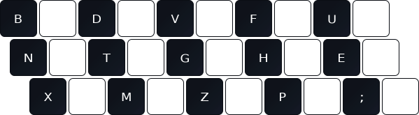
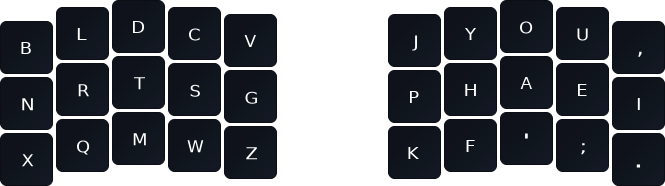
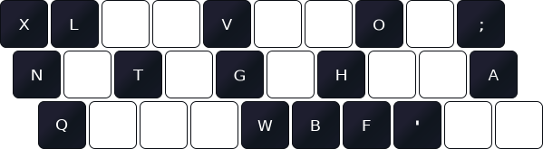

# Gallium
## Gallium is a keyboard layout that takes inspiration from nerps and tries to improve on it in comfort and speed. Now on Monkeytype! 

### This repo is currently undergoing some changes to bring all installations up to date. Currently Kanata is the most complete version which covers all variants and works on all operating systems. The Linux version currently provides both primary versions of Gallium (Rowstag and Colstag). The Windows and MacOS installations are out of date currently.

Gallium Rowstag (previously named Gallium v2): The Rowstag version was made to cater directly to the average user on a Row staggered keyboard based on feedback I received after the original version (Gallium Colstag) was made. Beforehand Gallium was made to be compatible with both Columnar staggered keyboards and Row staggered keyboards. The different layouts are simply a preference that may be slightly better on their respective keyboard types, you may still use either layout on either keyboard type.

Gallium Row Staggered:

Gallium Columnar Staggered:

## Operating systems
Windows, Mac and Linux are supported in varying levels, I use Linux myself so I'm biased towards agnostic implementations like [Kanata](https://github.com/jtroo/kanata). (Windows package made by CTGAP, Mac package made by Dainternetdude and Linux XKB file made by GalileoBlues.)

## Goals

Gallium tries to break up repetitive patterns, balance fatigue between the hands and be generally compatible with most people.

To break up repetitive patterns I've chosen to lower the amount of rolls and bring the ratio of alternation to rolls closer together, to do this I made the root vowel hand index letter H. without getting too complicated this affects a large amount of interactions on the vowel hand in general and also has the intended consequence of bringing the hand balance much closer together.

Although Gallium does have some pinky and ring usage that would require work to transition to from Qwerty I ultimately think it's a necessary evil. Otherwise Colemak is much less impactful to the pinkies and would suit said people better. This would naturally apply to people who have chronic issues with their pinky and ring fingers to which I would urge caution.

Gallium is closely related to a few layouts. Although there are a lot of layouts before Gallium that took heavy inspiration from [Sturdy](https://oxey.dev/sturdy/index.html) the finished layout is extremely similar to [Graphite](https://github.com/rdavison/graphite-layout) the predecessor of which predates Gallium by a few weeks. Gallium also traces its lineage from Nerps by Smudge, notably changing the vowel block and removing the need to alt finger `SP/PS` (alt fingering is pressing a letter with a different finger than a fully strict homerow form).

## Weaknesses
Gallium's performance in speed is dependent on a corpus of words just like every other alternative layout is, Gallium does particularly poorly at much more complex words such as Monkeytype's 450k wordlist setting but still does fine at 10k and below. the way it is worse is in SFBs as `HY`, `PY`, `PH` and `PF` bigrams occur much more commonly in that wordlist, one way to combat this is to alt finger them like spoken about previously.

## Etymology 
Gallium was named after the element as are most of my older layouts. G does bear significance to the way inner index column movement was optimised for but honestly the name just rips.

## Changes
Since Gallium has been out there have been some minor changes to the layout that I get asked about frequently, 

1) X and Q were swapped since QX never occurs and XQ occurs rarely, this barely affects the stats and is overall a minuscule change.
2) J and Z were swapped since it lowers SFBs and SFS slightly, I see no reason not to do this change.

Nerps made by Smudge:

